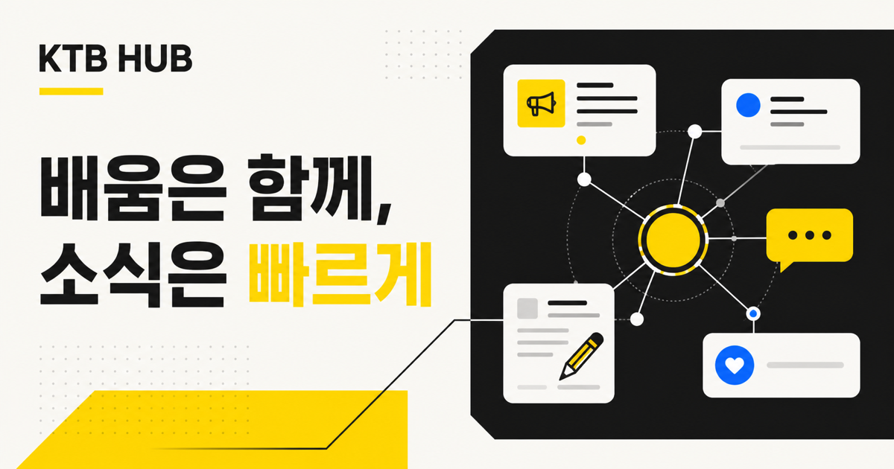
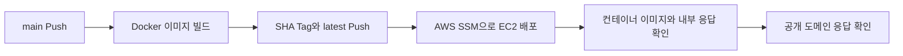

# KTB HUB



카카오테크 부트캠프의 소식과 학생들의 이야기가 모이는 커뮤니티 프론트엔드입니다.
학생들은 게시글을 작성하고, 댓글과 좋아요로 소통하며, 프로필과 계정 정보를 관리할 수 있습니다.

이 프로젝트는 기존 커뮤니티의 API 계약과 사용자 기능을 유지하면서 랜딩 페이지, 반응형 UI, 접근성, 오류·빈 상태를 포함한 전체 화면을 **KTB HUB** 콘셉트로 개편한 결과물입니다.

## 주요 기능

### 사용자 및 인증

- 이메일·닉네임 중복 확인을 포함한 회원가입
- 이메일과 비밀번호 로그인
- Access Token 기반 인증 및 인증 만료 처리
- 프로필 이미지와 닉네임 수정
- 비밀번호 변경
- 로그아웃 및 회원 탈퇴

### 커뮤니티

- 커서 기반 게시글 목록과 무한 스크롤
- 키워드 검색: 검색창에서 `Enter`로 실행
- 게시글 작성·조회·수정·삭제
- 게시글 이미지 업로드
- 좋아요 등록·취소
- 댓글 작성·수정·삭제
- 로딩·빈 목록·검색 결과 없음·오류·마지막 페이지 상태 표시

### UI/UX

- 서비스 소개를 위한 별도 랜딩 페이지
- 데스크톱·태블릿·모바일 반응형 레이아웃
- 모든 화면에 통일된 `KTB HUB` 텍스트 브랜드와 폰트 체계 적용
- 키보드 탐색, Skip Link, ARIA 상태와 네이티브 Form 적용
- 공통 Header, Dialog, 게시글 Card, 댓글 Component 사용
- 사용자 입력 렌더링 시 `textContent` 기반 DOM 생성으로 안전성 강화

## 서비스 범위

현재 백엔드에는 공지 전용 분류, 운영진 역할, 기수, 게시글 고정, 신청 마감 필드와 API가 없습니다. 따라서 현재 버전은 다음 범위에서 동작합니다.

- 모든 사용자가 함께 사용하는 통합 게시글 피드
- 기존 게시글·댓글·좋아요·검색·계정 기능
- 랜딩 페이지의 서비스 소개용 정적 콘텐츠

공지 전용 게시판이나 운영진 관리 기능을 실제 기능으로 제공하려면 백엔드 API와 데이터 모델 확장이 선행되어야 합니다.

## 기술 스택

| 구분 | 기술 |
| --- | --- |
| Frontend | HTML5, CSS3, Vanilla JavaScript, ES Modules |
| Web server | Node.js 22, Express |
| Authentication | Bearer Access Token, Local Storage |
| Test | Node.js Test Runner |
| Container | Docker, `node:22-alpine` |
| CI/CD | GitHub Actions, Docker Hub, AWS EC2, AWS Systems Manager |

## 화면 경로

| 화면 | 경로 | 인증 |
| --- | --- | --- |
| 랜딩 | `/` 또는 `/html/landing.html` | 불필요 |
| 로그인 | `/html/login.html` | 비로그인 사용자 |
| 회원가입 | `/html/signup.html` | 비로그인 사용자 |
| 커뮤니티 피드 | `/html/index.html` | 필요 |
| 게시글 상세 | `/html/board.html?id={postId}` | 필요 |
| 게시글 작성 | `/html/board-write.html` | 필요 |
| 게시글 수정 | `/html/board-modify.html?id={postId}` | 필요 |
| 회원정보 수정 | `/html/modifyInfo.html` | 필요 |
| 비밀번호 변경 | `/html/modifyPassword.html` | 필요 |

로그인 상태에서 로그인 또는 회원가입 화면에 접근하면 커뮤니티 피드로 이동합니다. 인증이 필요한 화면에서 유효한 세션을 확인하지 못하면 로그인 화면으로 이동합니다.

## 프로젝트 구조

```text
.
├── api/                    # 백엔드 API 요청 모듈
├── component/
│   ├── board/              # 게시글 목록 카드
│   ├── comment/            # 댓글 UI와 동작
│   ├── dialog/             # 공통 확인·알림 Dialog
│   └── header/             # 공통 Header와 계정 메뉴
├── css/
│   ├── common/layout.css   # 디자인 토큰과 공통 레이아웃
│   └── *.css               # 화면별 스타일
├── html/                   # 화면별 HTML
├── js/                     # 화면별 상태와 이벤트 처리
├── public/                 # 이미지, SVG, Animation, OG 이미지
├── test/                   # API 및 DOM 계약 회귀 테스트
├── utils/                  # 인증, 요청, 검증, 파일 처리 유틸리티
├── app.js                  # Express 정적 서버 및 런타임 설정
├── Dockerfile              # 운영 컨테이너 이미지
└── package.json
```

## 실행 방법

### 요구 사항

- Node.js 22 이상
- npm
- 연동할 커뮤니티 백엔드 API

### 설치

```bash
npm ci
```

### 환경변수

프로젝트 루트에 `.env` 파일을 만들고 API 주소를 설정합니다.

```dotenv
API_BASE_URL=http://localhost:3000
```

예시는 [`.env.example`](./.env.example)에서 확인할 수 있습니다.

`app.js`는 `/config.js` 요청에 다음 런타임 설정을 동적으로 제공합니다.

```js
window.__APP_CONFIG__ = {
    API_BASE_URL: 'http://localhost:3000',
};
```

`API_BASE_URL`이 비어 있으면 다음 주소를 사용합니다.

- 프론트엔드가 `localhost`에서 실행 중일 때: `http://localhost:3000`
- 그 외 환경: `https://api.daniel-community.cloud`

### 개발 서버 실행

```bash
npm run dev
```

### 일반 실행

```bash
npm start
```

브라우저에서 [http://localhost:8080](http://localhost:8080)에 접속합니다.

운영 API를 사용해 로컬에서 확인하려면 다음과 같이 실행할 수 있습니다.

```bash
API_BASE_URL=https://api.daniel-community.cloud npm start
```

> 글 작성이나 인증 화면에서 데이터를 불러오지 못한다면 프론트엔드뿐 아니라 `API_BASE_URL`에 지정된 백엔드가 실행 중인지 확인해야 합니다.

## npm 명령어

| 명령어 | 설명 |
| --- | --- |
| `npm start` | Express 서버를 `8080` 포트에서 실행 |
| `npm run dev` | Nodemon으로 개발 서버 실행 |
| `npm test` | API·DOM 계약 회귀 테스트 실행 |

## 테스트

```bash
npm test
```

테스트는 다음 계약을 보호합니다.

- 인증, 게시글, 댓글, 좋아요, 검색, 계정 API의 URL·Method·Payload
- 인증 요청의 `Authorization: Bearer {accessToken}` Header
- JavaScript가 사용하는 주요 DOM ID
- 로그인·회원가입의 네이티브 Form 구조
- HTML 언어 정보, Skip Link와 로컬 Asset 경로
- 기존 고정 너비 레이아웃과 인라인 보라색 상태 스타일의 재유입 방지

## API 개요

프론트엔드는 별도 백엔드 서버와 통신합니다. 대표 API 계약은 다음과 같습니다.

| 기능 | Method | Endpoint |
| --- | --- | --- |
| 로그인 | `POST` | `/users/login` |
| 회원가입 | `POST` | `/users/signup` |
| 내 정보 조회 | `GET` | `/users/me` |
| 내 정보 수정·탈퇴 | `PATCH`, `DELETE` | `/users/me` |
| 비밀번호 변경 | `PATCH` | `/users/me/password` |
| 게시글 목록·작성 | `GET`, `POST` | `/posts` |
| 게시글 검색 | `GET` | `/posts/search?keyword={keyword}` |
| 게시글 상세·수정·삭제 | `GET`, `PATCH`, `DELETE` | `/posts/{postId}` |
| 좋아요 등록·취소 | `POST`, `DELETE` | `/posts/{postId}/likes` |
| 댓글 목록·작성 | `GET`, `POST` | `/posts/{postId}/comments` |
| 댓글 수정·삭제 | `PATCH`, `DELETE` | `/posts/{postId}/comments/{commentId}` |

API 모듈은 `api/`에 있으며, 공통 JSON 응답 처리와 Bearer Token 주입은 `utils/request.js`에서 담당합니다. `401 Unauthorized` 응답을 받으면 저장된 Access Token을 제거합니다.

## 브라우저 저장소

| 저장소 | Key | 용도 |
| --- | --- | --- |
| Local Storage | `accessToken` | 로그인 Access Token |
| Local Storage | `profileImageUrl` | 회원가입·프로필 수정 중 업로드한 임시 이미지 URL |
| Local Storage | `postFileUrl` | 게시글 작성·수정 중 업로드한 임시 이미지 URL |
| Session Storage | `toastMessage` | 화면 이동 후 한 번 표시할 안내 메시지 |

## Docker

이미지는 다운로드와 배포 시간을 줄이기 위해 `node:22-alpine`을 사용하며, 애플리케이션은 컨테이너 내부의 비루트 `node` 사용자로 실행됩니다.

```bash
docker build -t ktb-hub-frontend .
docker run --rm \
  -p 8080:8080 \
  -e API_BASE_URL=https://api.daniel-community.cloud \
  ktb-hub-frontend
```

## 배포

`main` 브랜치에 Push하면 `.github/workflows/4-daniel-community-fe.yml`이 실행됩니다.



배포에는 `latest`가 아닌 Git Commit SHA Tag를 사용합니다. 이미지 다운로드, 컨테이너 실행, 내부 랜딩 응답 또는 공개 도메인 검증 중 하나라도 실패하면 Workflow도 실패합니다.

### GitHub Actions Secrets

| Secret | 설명 |
| --- | --- |
| `DOCKER_USERNAME` | Docker Hub 사용자명 |
| `DOCKER_PASSWORD` | Docker Hub 비밀번호 또는 Access Token |
| `AWS_ACCESS_KEY_ID` | SSM 명령 권한이 있는 AWS Access Key |
| `AWS_SECRET_ACCESS_KEY` | AWS Secret Access Key |
| `AWS_REGION` | EC2와 SSM을 사용하는 AWS Region |
| `EC2_INSTANCE_ID` | 배포 대상 EC2 Instance ID |

### SSM 배포 문제 해결

다음 오류는 애플리케이션 오류가 아니라 EC2의 SSM Agent worker가 비정상 종료된 상태를 의미합니다.

```text
document process failed unexpectedly: ipc messaging received timeout signal
```

동일한 오류가 반복되면 EC2에서 다음 항목을 확인합니다.

1. `/var/log/amazon/ssm/`의 `amazon-ssm-agent` 및 worker 로그
2. EC2의 메모리와 디스크 여유 공간
3. Amazon SSM Agent 버전과 실행 상태
4. EC2가 Docker Hub에 접근할 수 있는지 여부
5. `EC2_INSTANCE_ID`가 공개 도메인이 연결된 실제 운영 서버인지 여부

## 운영 주소

- Frontend: [https://www.daniel-community.cloud](https://www.daniel-community.cloud)
- Backend API: [https://api.daniel-community.cloud](https://api.daniel-community.cloud)

## 라이선스

이 프로젝트의 `package.json`에는 `Proprietary` 라이선스가 명시되어 있습니다. 별도 허가 없이 복제·배포·상업적으로 이용할 수 없습니다.
